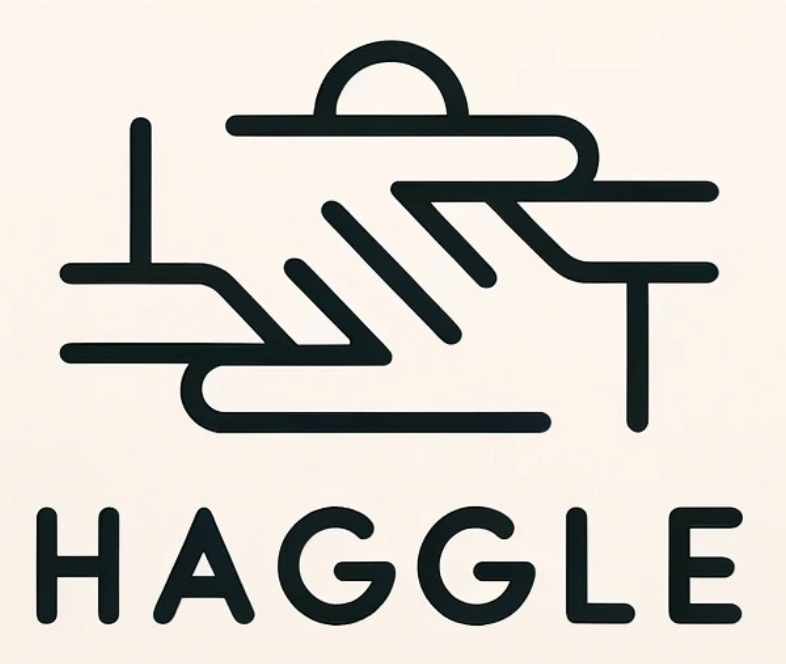

<p align="center">
  
</p>

<p align="center">Practice your communication skills in challenging situations</p>

<br/>

Made during the [Oxford Gen AI Summit 2023 Hackathon](https://www.oxgensummit.org/).

## Deploy

First, download and install [ffmpeg](https://www.ffmpeg.org/).

Then, obtain API keys from OpenAI and Google Cloud Platform and save them to `.env` in the root directory:

```env
GCP_API_KEY="..."
OPENAI_API_KEY="..."
```

Next, install the dependencies:

```bash
yarn install
```

Then, run the development server:

Make sure you enter a virtualenv for the python backend.

```bash
python -m venv venv
source venv/bin/activate
yarn dev
```

Open [http://localhost:3000](http://localhost:3000) with your browser to see the result.

The backend will be running on [http://127.0.0.1:8000](http://127.0.0.1:8000).
